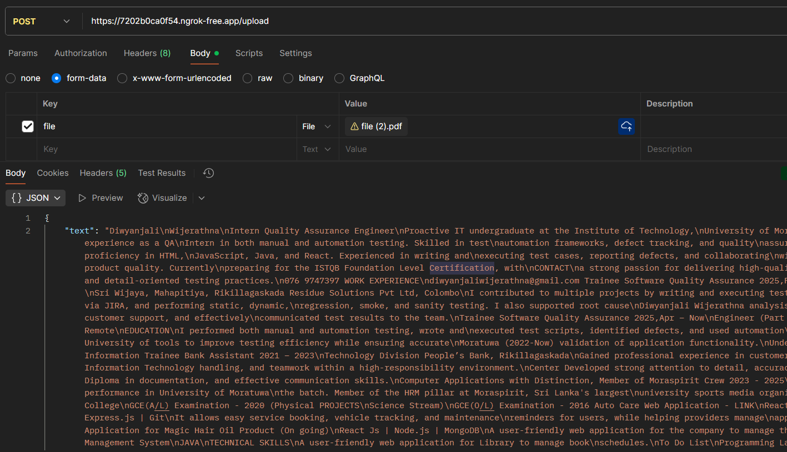

# CV Parser Backend

This is a Python FastAPI backend that:

- Accepts PDF CV uploads  
- Extracts text using **pdfplumber**  
- Converts key details into structured JSON  

---

## How to Run Locally

1. Clone the repo:
```bash
git clone <your-repo-url>
cd <repo-folder>
````

2. Install dependencies:

```bash
pip install -r requirements.txt
```

3. Run the server:

```bash
python main.py
```

---

## API Endpoint

**POST** `/upload`

Form field: `file` → your CV PDF file

Returns:

```json
{
  "text": "... full CV text ...",
}
```

---

## Example



---
